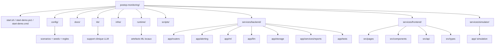
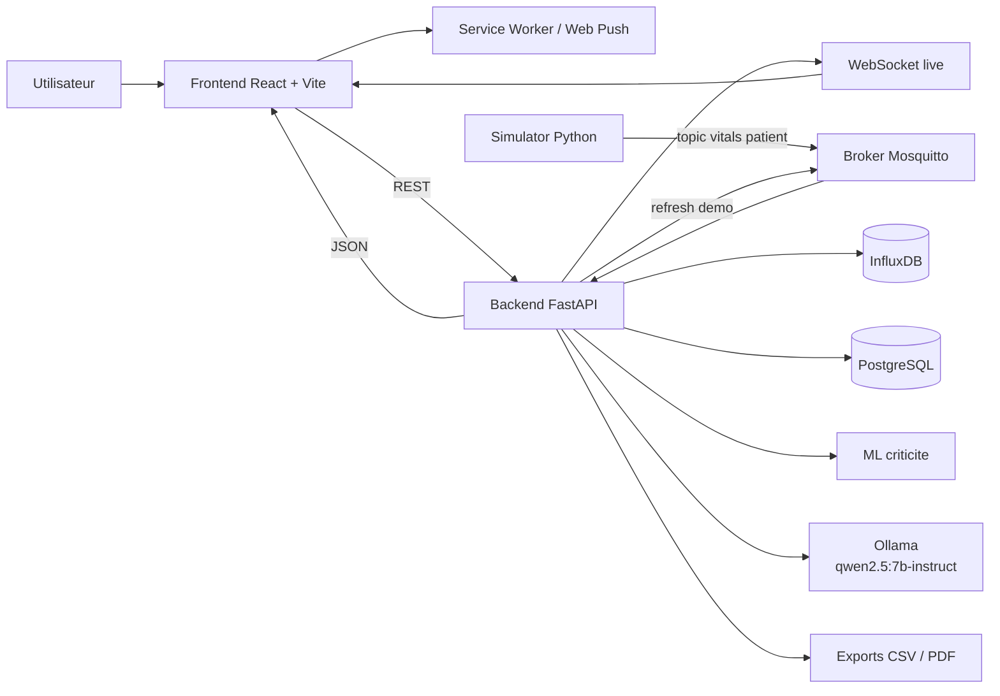
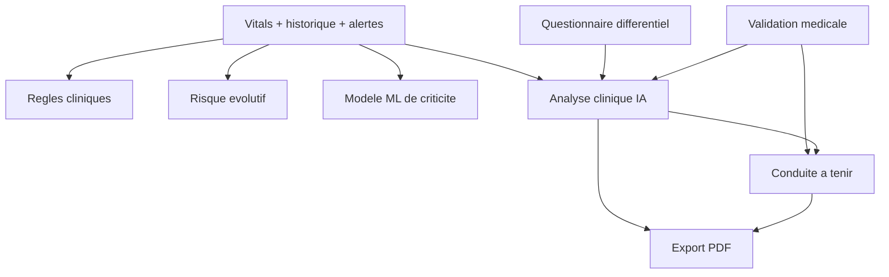

# Monitoring post-operatoire a domicile

Projet MBA1 Epitech de monitoring post-operatoire a domicile.

Le projet simule plusieurs patients, envoie leurs constantes via MQTT, applique des regles d'alerte, calcule un score ML de criticite, produit une analyse clinique assistee par LLM, puis expose le tout dans un dashboard web temps reel.

Pipeline principal: simulation -> MQTT -> backend -> stockage -> frontend -> export / notification.

Le systeme vise une assistance clinique prudente et explicable. Il ne remplace pas un diagnostic medical autonome.

## Demarrage rapide

Commande recommande pour macOS et Windows: `docker compose up --build -d`. C'est le point d'entree principal du projet, a lancer depuis le dossier racine clone (`postop-monitoring/`).

Prerequis:

- Docker Desktop ou Docker Engine avec `docker compose`
- lancer les commandes depuis le dossier racine du projet clone (`postop-monitoring/`)

Commande principale:

```bash
docker compose up --build -d
```

Si vous partez d'un nouveau clone:

```bash
git clone <url-du-repo>
cd postop-monitoring
docker compose up --build -d
```

Cette commande:

- construit et demarre toute la stack
- marche directement dans Terminal sur macOS et dans PowerShell sur Windows
- ne demande pas Bash / Git Bash

## Scripts de secours

Si vous preferez les scripts du projet, ou si vous voulez les verifications additionnelles (`.env`, attente HTTP, demarrage de Docker Desktop), utilisez:

- [`start.sh`](./start.sh) sur macOS / Linux / Git Bash
- [`start-demo.ps1`](./start-demo.ps1) sur Windows PowerShell

### Secours macOS / Linux / Git Bash

```bash
NO_BROWSER=1 ./start.sh
```

`start.sh` a ete verifie dans Bash / Git Bash.

Depuis PowerShell, vous pouvez aussi appeler le meme script via Git Bash sans ouvrir un terminal Git Bash:

```powershell
$env:NO_BROWSER = "1"
& "$Env:ProgramFiles\Git\bin\bash.exe" "./start.sh"
```

Commande a lancer depuis le dossier racine du projet. Si Git n'est pas installe dans `C:\Program Files\Git`, adaptez le chemin vers `bash.exe`.

### Secours Windows

Si vous utilisez PowerShell ou Terminal Windows, utilisez [`start-demo.ps1`](./start-demo.ps1):

```powershell
.\start-demo.ps1
```

Ce script demarre aussi Docker Desktop si le daemon n'est pas deja pret.

Alternative double-clic / Windows:

```bat
start-demo.cmd
```

Equivalent `make`:

```bash
make start-demo
```

## URLs utiles

- Frontend: `http://localhost:5173`
- Backend API: `http://localhost:8000`
- Backend docs: `http://localhost:8000/docs`
- Healthcheck: `http://localhost:8000/health`
- Healthcheck LLM: `http://localhost:8000/health/llm`
- InfluxDB: `http://localhost:8086`
- PostgreSQL: `localhost:5432`
- Mosquitto MQTT: `localhost:1883`

## Objectif

- simuler un suivi post-operatoire multi-patients
- visualiser les constantes et alertes en temps reel
- aider l'orientation clinique avec une logique hybride
- fournir un support de demo simple a lancer

## Approche hybride

La logique reste volontairement hybride:

- regles cliniques pour les seuils et alertes critiques
- ML pour le score longitudinal de criticite
- LLM pour la synthese, les hypotheses et la conduite a tenir

## Stack

- Simulator Python + `paho-mqtt`
- Mosquitto pour MQTT
- FastAPI pour REST + WebSocket
- InfluxDB pour l'historique des constantes
- PostgreSQL pour les patients, alertes, cache d'analyse, notifications et feedback ML
- React + Vite pour le dashboard
- `LogisticRegression` pour le score ML de criticite
- `IsolationForest` pour le bonus anomalies
- Ollama local avec `qwen2.5:7b-instruct` pour le bonus LLM

## Schema structurel du projet



Lecture rapide:

- `docker compose up --build -d` est la commande principale cross-platform pour lancer la stack
- `start.sh` et `start-demo.ps1` restent disponibles comme scripts de secours
- `config/` contient les scenarios, seeds patients et regles
- `services/backend/` porte la logique centrale: ingestion, alertes, ML, LLM, stockage et exports
- `services/frontend/` porte l'interface React du dashboard
- `services/simulator/` genere les constantes vitales simulees
- `kb/` contient la base de connaissances locale exploitee par le LLM
- `runtime/` stocke les artefacts locaux comme les fichiers ML

## Activation des fonctions

Les flags principaux sont definis dans [`.env.example`](./.env.example):

- `ENABLE_ML=true`: active le score ML de criticite et les services ML associes
- `ENABLE_LLM=false`: active les routes LLM sur Ollama; sinon le backend reste sur un fallback local `rule-based`
- `ENABLE_WEBPUSH=false`: active les abonnements push navigateur via service worker + backend
- `APP_TEST_MODE=false`: force le backend en mode test, desactive le LLM et bascule les stockages principaux sur des implementations memoire

## Schema d'architecture



## Lecture de l'architecture

- le simulateur genere les constantes de plusieurs patients a partir des scenarios
- il publie les constantes sur MQTT
- le backend consomme les messages, stocke l'historique, applique les regles d'alerte et diffuse le live
- le front affiche le tableau de bord, les graphes, les hypotheses et les scores
- le ML apprend la criticite a partir des vitals et feedbacks
- le LLM reformule l'analyse clinique et la conduite a tenir
- le PDF synthetise le cas clinique exporte

## Services Docker

- `simulator`: simulation des cas cliniques
- `mosquitto`: broker MQTT
- `backend`: API, regles, ML, LLM, PDF, WebSocket
- `frontend`: dashboard React
- `postgres`: stockage relationnel
- `influxdb`: historique des constantes
- `ollama`: serveur local LLM

## Fonctionnement clinique

L'interface distingue plusieurs blocs:

- `Criticite immediate`: danger instantane base sur les seuils et alertes du moment
- `Risque evolutif`: derive clinique observee depuis `J0`
- `Score ML historique`: score appris a partir de la trajectoire du patient
- `Analyse clinique IA`: synthese structuree produite par le backend via LLM + fallback local

Important:

- le simulateur ne change pas a cause du contexte patient ou de la validation medicale
- le LLM n'est pas reentraine localement
- la validation medicale met a jour l'analyse clinique
- l'entrainement ML reste une action separee

## Schema fonctionnel



## Organisation des fonctions

Le backend se repartit en couches distinctes.

- `Ingestion temps reel`
  - recoit les constantes MQTT
  - met a jour l'etat patient, l'historique et les alertes
  - fichiers: [`consumer.py`](./services/backend/app/mqtt/consumer.py), [`engine.py`](./services/backend/app/alerting/engine.py)

- `Regles et criticite immediate`
  - detecte les seuils franchis et les alertes composites
  - alimente les alertes `INFO / WARNING / CRITICAL`
  - fichiers: [`engine.py`](./services/backend/app/alerting/engine.py), [`alert_rules.json`](./config/alert_rules.json)

- `ML de criticite`
  - construit les features de trajectoire
  - enregistre `vitals.csv` et `labeled_feedback.csv`
  - entraine `model.pkl`
  - calcule le `Score ML historique`
  - fichiers: [`criticity_service.py`](./services/backend/app/ml/criticity_service.py), [`features.py`](./services/backend/app/ml/features.py), [`ml.py`](./services/backend/app/routers/ml.py)

- `Analyse clinique IA`
  - construit le `clinical-package`
  - fusionne vitals, historique, alertes, questionnaire, validation medicale et KB locale
  - appelle le LLM si disponible, sinon fallback `rule-based`
  - fichiers: [`llm.py`](./services/backend/app/routers/llm.py), [`prompt_templates.py`](./services/backend/app/llm/prompt_templates.py), [`validated_categories.py`](./services/backend/app/llm/validated_categories.py), [`kb.py`](./services/backend/app/llm/kb.py)

- `Questionnaire differentiel`
  - choisit les modules de questions selon le tableau clinique
  - renvoie des indices pour reorienter les hypotheses
  - fichiers: [`questionnaire.py`](./services/backend/app/llm/questionnaire.py), [`questionnaire_rules.json`](./config/questionnaire_rules.json)

- `Validation medicale`
  - enregistre le diagnostic final et le commentaire
  - bascule l'analyse du mode `pre-validation` au mode `post-validation`
  - ne reentraine pas automatiquement le modele ML
  - fichiers: [`ml.py`](./services/backend/app/routers/ml.py), [`postgres.py`](./services/backend/app/storage/postgres.py)

- `Conduite a tenir`
  - genere une guidance post-validation
  - adapte la surveillance et les criteres d'escalade au diagnostic valide
  - fichiers: [`llm.py`](./services/backend/app/routers/llm.py), [`postop-terrain-context-guidance.md`](./kb/postop-terrain-context-guidance.md)

- `PDF et exports`
  - assemble les donnees cliniques, la validation medicale, la conduite a tenir et les courbes
  - genere le PDF final
  - fichiers: [`clinical_report_service.py`](./services/backend/app/services/reports/clinical_report_service.py), [`pdf_renderer.py`](./services/backend/app/services/reports/pdf_renderer.py), [`export.py`](./services/backend/app/routers/export.py)

## Separation regles / ML / LLM

- `Regles`
  - seuils immediats
  - alertes critiques
  - fallback d'analyse si le LLM ne repond pas

- `ML`
  - apprend la criticite a partir de l'historique
  - s'appuie sur une pipeline `StandardScaler + LogisticRegression`
  - produit un score longitudinal
  - ne choisit pas seul le diagnostic clinique final

- `LLM`
  - explique, synthetise et reformule
  - integre questionnaire, contexte patient et validation medicale
  - n'est pas fine-tune par le projet

## Validation medicale

Le projet separe:

- `pre-validation`: hypotheses libres par compatibilite clinique
- `post-validation`: diagnostic medical valide en tete, puis risques/points de surveillance a garder

Apres validation medicale:

- l'analyse clinique est rafraichie
- la conduite a tenir est recalculee
- le diagnostic valide sert d'ancre clinique
- le modele ML n'est pas reentraine automatiquement

## Notifications

Le projet supporte:

- notifications live dans l'application
- notifications navigateur
- Web Push via Service Worker + backend

Routes associees:

- `GET /api/push/config`
- `POST /api/push/subscriptions`
- `DELETE /api/push/subscriptions`

Limite importante:

- onglet ferme: possible selon le navigateur
- navigateur totalement ferme: comportement dependant du poste et du navigateur

## Organisation des fichiers

Arborescence utile:

```text
postop-monitoring/
|-- config/
|   |-- alert_rules.json
|   |-- cases_catalog.json
|   |-- patients_seed.json
|   |-- questionnaire_rules.json
|   `-- simulation_scenarios.json
|-- docs/
|   |-- api.md
|   |-- architecture.mmd
|   |-- case-generation.md
|   |-- clinical-references.md
|   |-- antecedents-context-catalog.md
|   |-- questionnaire-differentiel.md
|   `-- terrain-risk-weighting.md
|-- infra/
|   |-- mosquitto/
|   `-- postgres/
|-- kb/
|   |-- postop-home-monitoring-signs.md
|   |-- postop-terrain-context-guidance.md
|   `-- postop-terrain-context-sources.md
|-- runtime/
|   |-- .gitkeep
|   `-- ml/
|       |-- vitals.csv
|       |-- labeled_feedback.csv
|       `-- model.pkl
|-- scripts/
|   |-- seed_patients.py
|   |-- validate_rules.py
|   |-- setup_ollama_model.ps1
|   |-- backfill_alert_uncertainty.py
|   `-- outils annexes de generation / audit
|-- services/
|   |-- backend/
|   |   `-- app/
|   |       |-- alerting/
|   |       |-- llm/
|   |       |-- ml/
|   |       |-- mqtt/
|   |       |-- routers/
|   |       |-- services/
|   |       |-- storage/
|   |       |-- tests/
|   |       `-- ws/
|   |-- frontend/
|   |   `-- src/
|   |       |-- api/
|   |       |-- components/
|   |       |-- pages/
|   |       `-- types/
|   `-- simulator/
|       `-- app/
|-- docker-compose.yml
|-- start-demo.cmd
|-- start-demo.ps1
`-- start.sh
```

## Role des dossiers principaux

- [`config`](./config): configuration clinique et scenarios
- [`docs`](./docs): documentation technique et clinique
- [`kb`](./kb): base de connaissances courte utilisee par le LLM
- [`runtime`](./runtime): donnees et artefacts locaux non versionnes
- [`services/backend`](./services/backend): logique centrale du projet
- [`services/frontend`](./services/frontend): dashboard web
- [`services/simulator`](./services/simulator): generation des constantes

## Fichiers backend importants

- [`main.py`](./services/backend/app/main.py): assemblage de l'application
- [`routers/llm.py`](./services/backend/app/routers/llm.py): analyse clinique, questionnaire, conduite a tenir
- [`routers/ml.py`](./services/backend/app/routers/ml.py): prediction et feedback ML
- [`mqtt/consumer.py`](./services/backend/app/mqtt/consumer.py): ingestion temps reel
- [`alerting/engine.py`](./services/backend/app/alerting/engine.py): regles d'alerte
- [`ml/criticity_service.py`](./services/backend/app/ml/criticity_service.py): entrainement et prediction
- [`services/reports/clinical_report_service.py`](./services/backend/app/services/reports/clinical_report_service.py): construction du rapport clinique

## Fichiers frontend importants

- [`main.tsx`](./services/frontend/src/main.tsx): bootstrap de l'application
- [`pages/Patients.tsx`](./services/frontend/src/pages/Patients.tsx): liste des patients
- [`pages/PatientDetail.tsx`](./services/frontend/src/pages/PatientDetail.tsx): ecran principal patient
- [`api/http.ts`](./services/frontend/src/api/http.ts): appels REST
- [`api/ws.ts`](./services/frontend/src/api/ws.ts): flux live

## Endpoints principaux

- `GET /health`
- `GET /health/llm`
- `GET /api/patients`
- `GET /api/patients/{patient_id}/last-vitals`
- `GET /api/trends/{patient_id}?metric=all&hours=24`
- `GET /api/alerts?patient_id=PAT-003`
- `POST /api/alerts/{alert_id}/ack`
- `GET /api/export/{patient_id}/csv`
- `GET /api/export/{patient_id}/pdf`
- `GET /api/llm/{patient_id}/scenario-review`
- `GET /api/llm/{patient_id}/clinical-package`
- `GET /api/llm/{patient_id}/questionnaire`
- `POST /api/llm/{patient_id}/clinical-package`
- `POST /api/llm/{patient_id}/terrain-guidance`
- `GET /api/llm/prioritize/patients`
- `GET /api/ml/{patient_id}/predict`
- `POST /api/ml/{patient_id}/feedback`
- `POST /api/ml/train`
- `GET /api/notifications`
- `POST /api/notifications/{notification_id}/read`
- `WS /ws/live`

## Commandes utiles

Commande principale:

```bash
docker compose up --build -d
```

Les commandes ci-dessous servent surtout au support, au debug et a la demo.

```bash
make up
make start-demo
make down
make logs
make validate-rules
make seed
make refresh-alerts
```

## Demo conseillee

1. ouvrir la liste des patients
2. montrer `PAT-001` comme cas temoin stable
3. lancer un `Refresh demo`
4. ouvrir un patient pathologique
5. montrer le graphe `Depuis J0`
6. montrer alertes actives et historiques
7. afficher le pack clinique IA
8. remplir le questionnaire si propose
9. valider medicalement la pathologie si besoin
10. generer le PDF

## LLM local

Le projet utilise par defaut `qwen2.5:7b-instruct` via Ollama.

Fichiers utiles:

- [docs/llm-local.md](./docs/llm-local.md)
- [setup_ollama_model.ps1](./scripts/setup_ollama_model.ps1)

Exemple d'activation:

```powershell
docker compose up -d ollama
.\scripts\setup_ollama_model.ps1 -StartOllama
docker compose up --build -d backend
```

Le backend retombe en `rule-based` si le LLM est indisponible ou trop lent.

## Limites actuelles

- le simulateur part de baselines encore proches d'un patient a l'autre
- le ML apprend surtout la criticite, pas un vrai diagnostic differentiel complet
- le LLM n'est pas fine-tune localement
- certaines notifications hors navigateur actif dependent du poste et du navigateur
- le mode demo reste prioritaire sur une exhaustivite clinique complete

## References utiles du projet

- [docs/architecture.mmd](./docs/architecture.mmd)
- [docs/case-generation.md](./docs/case-generation.md)
- [docs/clinical-references.md](./docs/clinical-references.md)
- [docs/antecedents-context-catalog.md](./docs/antecedents-context-catalog.md)
- [docs/questionnaire-differentiel.md](./docs/questionnaire-differentiel.md)
- [kb/postop-home-monitoring-signs.md](./kb/postop-home-monitoring-signs.md)
- [config/alert_rules.json](./config/alert_rules.json)
- [config/simulation_scenarios.json](./config/simulation_scenarios.json)
- [config/patients_seed.json](./config/patients_seed.json)
